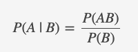
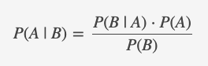
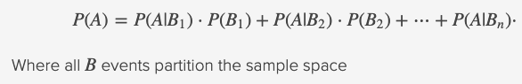

# <a name="top">DSI Notes</a>

# Tables of Contents:
* [CLI Scripting](#cli)
* [Unix](#unix)
* [Git](#git)
* [Python](#python)
    * [Pandas](#pandas)
    * [Numpy](#numpy)
    * [Scipy](#scipy)
    * [Matplotlib](#matplot)
* [Machine Learning Workflow](#mlw)

______________________________________________

# List of things to look into:

* MyPy (DropBox is currently working on MyPyC)
* Download p4merge
* look into internet extenders
* find out what map() is

______________________________________________

# Links:

* [DateTime](https://www.analyticsvidhya.com/blog/2020/05/datetime-variables-python-pandas/)
* [Git Reference](https://git-scm.com/docs)
* [Unix Cheat Sheet](http://www.mathcs.emory.edu/~valerie/courses/fall10/155/resources/unix_cheatsheet.html)
* [Markdown cheat sheet](https://www.markdownguide.org/cheat-sheet)
* [Color brewer](https://colorbrewer2.org/#type=sequential&scheme=BuGn&n=3)
* [Univariate distribution relationshipd](http://www.math.wm.edu/~leemis/chart/UDR/UDR.html)
* [Visualizing `scipy.stats` distributions](https://stackoverflow.com/questions/37559470/what-do-all-the-distributions-available-in-scipy-stats-look-like)
* [MathJax basic tutorial and quick reference](https://math.meta.stackexchange.com/questions/5020/mathjax-basic-tutorial-and-quick-reference)

______________________________________________

# <a name="cli">CLI Scripting</a>
* bash profile location on OSX: `~/.bash_profile`
* for zsh use: `~/.zshrc`

#### how to make a bash / zsh function

```zsh
function gitadder(){
    git pull
    git add -A
    if [ "$1" != "" ] then
        git commit -m "$1: $(date '+%b %d, %Y %H:%M:%S')"
    else
        git commit -m "Auto Update: $(date '+%b %d, %Y %H:%M:%S')"
    fi
    git push
}
```

#### call this function using

```zsh
gitadder "Enter update text"

# Or just...

gitadder
```

[Back to top](#top)
______________________________________________

# <a name="unix">Unix</a>

* `echo "Hello World"` - prints message to screen
* `echo "Hello World" > hello.txt` - prints message to file (creates new file or overwrites existing)
* `echo "goodbye" >> hello.txt` - appends message to the end of file
* `cat hello.txt` - prints file to terminal
* `man ls` - print out a help menu for the command
* `history > history.txt` - saves command history in a file
* `grep <command filter>` - looks at sheet of text to find 
* `!<history number>` - runs command from a certain line in history

[Back to top](#top)
______________________________________________

# <a name="git">Git</a>

* `git status` - Display the state of the working directory and the staging area and see which changes have been staged, which haven't, and which files aren't being tracked by Git

* `git log` - View version history of current branch (to exit this type `q`)

* `git reset [file]` - Unstages the file, but it preserves the file contents.

* `git reset [commit]` - Undoes all the commits after the specified commit and preserves the changes locally.

* `git add .` - Adds all files from the root directory to the staging area

* `git add -A` - Adds all files root and sub directories to the staging area

* `git add [filename1 filename2]` - Adds only listed files to the staging area

* `git commit -m "[Enter commit message]"` - Creates a new commit containing the current contents of the index

* `git pull` - Fetches and merges changes on the remote server to your working directory

* `git push` - Send your updates and new files in your commit from your local machine to the remote repository

* `git revert [commit]` - Undo the commit


[Back to top](#top)
______________________________________________

# <a name="stats">Statistics</a>

#### Conditional probability
The probability of event A given B. When the two events are independent, the probabilty is simply P(A).



#### Bayes' theorem
Describes the probability of a posterior event, based on previous conditions related to the event. For example, given the probabilities P(B) and P(B | A), Bayes' theorem can be applied to calculate P(A | B).

Tip: it's a bayes problem if there's two different



#### Law of total probability



[Back to top](#top)
______________________________________________

# <a name="python">Python</a>
#### Generator expressions
Some simple generators can be coded succinctly as expressions using a syntax similar to list comprehensions but with parentheses instead of square brackets. These expressions are designed for situations where the generator is used right away by an enclosing function. Generator expressions are more compact but less versatile than full generator definitions and tend to be more memory friendly than equivalent list comprehensions.

```python
sum(i*i for i in range(10))         # sum of squares

# instead of...

sum([i*i for i in range(10)])       # needlessly allocates a list in memory
```

## <a name="pandas">Pandas</a>
#### Create a DataFrame
* from a dictionary (creating by columns)

    ```python
    df = pd.DataFrame({'Letters': ['a','b','c'],
                       'Numbers': [1,2,3]})
    ```

* from list of lists (creating by rows)

    ```python
    df = pd.DataFrame([['a', 1],
                       ['b', 2],
                       ['c', 3]],
                       columns=['Letters','Numbers'])
    ```

* from csv (use parameter `sep='\t'` for txt file)

    ```python
    df_csv = pd.read_csv('filename.csv')
    df_txt = pd.read_csv('filename.txt', sep='\t')
    ```

#### Drop a column

```python
df.drop('col_1', axis = 1)
```

#### Rename columns

```python
df.rename(columns={'old_name': 'new_name'})
```

#### Value counts for a column (i.e. series)

```python
s.value_counts(dropna=False)
```

#### Fill NA with mean (mean can be replaced with other stat functions)

```python
s.fillna(s.mean())
```

#### Convert a series of str formatted dates into a datetime type

```python
norm_dates = pd.to_datetime(str_dates, format='%Y%m%d')
```

[Back to top](#top)
______________________________________________

## <a name="numpy">Numpy</a>

#### Create an array

```python
a = np.array([1,2,3,4,5,6])     # 1D
b = np.array([[1,2,3],          # 2D
              [4,5,6]])
c = np.array([[[1,2,3],         # 3D
               [4,5,6]],
              [[7,8,9],
               [10,11,12]]])
```

#### Reshape array

```python
a = np.array([1,2,3,4,5,6]).reshape(2,3)  # 2 rows, 3 cols
```

#### Create an array of evenly spaced values (by step)

```python
a = np.arange(1,10,2)
```

#### Create an array of evenly spaced values (by # of samples)

```python
a = np.linespace(1,10,100)
```

[Back to top](#top)
______________________________________________

## <a name="scipy">Scipy</a>


[Back to top](#top)
______________________________________________

## <a name="matplot">matplotlib</a>

______________________________________________

# <a name="mlw">Machine Learning Workflow</a>


[Back to top](#top)